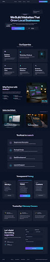

# 🚀 Avenix Digital Agency

> A premium, modern, and business-focused landing page for **Avenix Digital Agency**. Built to convert visitors into clients with stunning glassmorphism aesthetics, buttery-smooth animations, and direct WhatsApp integrations.

 *(Note: Add a screenshot of the hero section here and name it `screenshot.png`)*

---

## ✨ Key Features

- **Premium Glassmorphism UI**: A highly aesthetic, modern dark theme utilizing deep blues, purples, and blurred glass card effects to establish immediate technical authority.
- **Buttery Smooth Animations**: Powered by **Framer Motion**, featuring scroll-triggered entrances, interactive hover states, and an infinite scrolling tech marquee.
- **Direct WhatsApp Integration**: The contact form and call-to-action buttons automatically format user data and open a pre-filled WhatsApp chat for instant lead capture.
- **Conversion-Optimized Layout**: Includes a Hero Section, Services, Portfolio, Pricing, Testimonials, FAQ, and a sticky Scroll Progress Indicator.
- **Fully Responsive**: Mobile-first design ensuring the agency looks pristine on all screen sizes.

## 🛠️ Tech Stack

This project is built with a modern, lightning-fast frontend stack:

- **Framework**: [React 18](https://react.dev/)
- **Build Tool**: [Vite](https://vitejs.dev/)
- **Styling**: [Tailwind CSS v3](https://tailwindcss.com/)
- **Animations**: [Framer Motion](https://www.framer.com/motion/)
- **Icons**: [Google Material Symbols](https://fonts.google.com/icons)
- **Typography**: [Plus Jakarta Sans](https://fonts.google.com/specimen/Plus+Jakarta+Sans)

## 📂 Project Structure

```text
avenix-web/
├── public/                # Static assets (Favicons, etc.)
├── src/
│   ├── components/        # Reusable UI sections
│   │   ├── Navbar.jsx
│   │   ├── HeroSection.jsx
│   │   ├── TechMarquee.jsx
│   │   ├── ServicesSection.jsx
│   │   ├── Portfolio.jsx
│   │   ├── Pricing.jsx
│   │   ├── FAQ.jsx
│   │   ├── Testimonials.jsx
│   │   ├── ContactCTA.jsx
│   │   ├── PrivacyPolicy.jsx
│   │   └── Footer.jsx
│   ├── App.jsx            # Main application & layout composition
│   ├── main.jsx           # React DOM entry point
│   └── index.css          # Global styles & Tailwind configuration
├── tailwind.config.js     # Tailwind theme extensions
└── vite.config.js         # Vite configuration
```

## 🚀 Getting Started

Follow these instructions to run the project locally.

### Prerequisites
Make sure you have [Node.js](https://nodejs.org/) installed on your machine.

### Installation

1. **Clone the repository:**
   ```bash
   git clone https://github.com/avenix-web/avenix.git
   cd avenix-web
   ```

2. **Install dependencies:**
   ```bash
   npm install
   ```

3. **Start the development server:**
   ```bash
   npm run dev
   ```

4. **View the site:**
   Open your browser and navigate to `http://localhost:5173`

## 📦 Deployment

This project is optimized for static hosting platforms like Vercel, Netlify, or AWS Amplify.

To create a production build:
```bash
npm run build
```
This will generate a `dist` folder containing the optimized, minified files ready for deployment.

---

## 📞 Contact & Support

For business inquiries or project support:
- **Email**: hi.avenix@gmail.com
- **WhatsApp**: +91 9348250968
- **Location**: Bhubaneswar, Odisha, India

---
*Built with ❤️ for Avenix Digital.*
